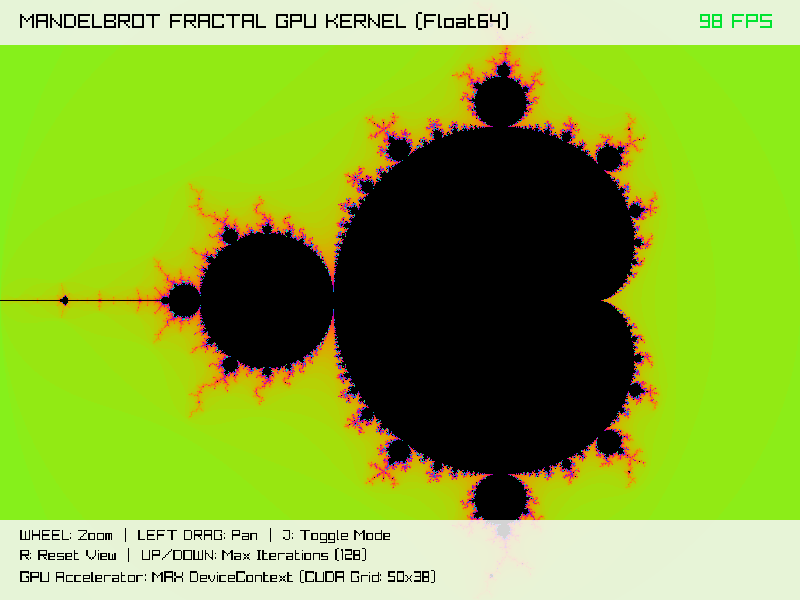
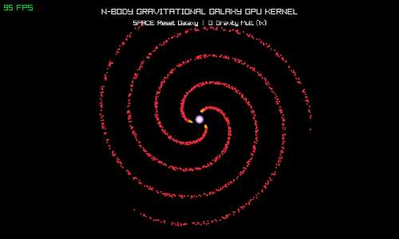
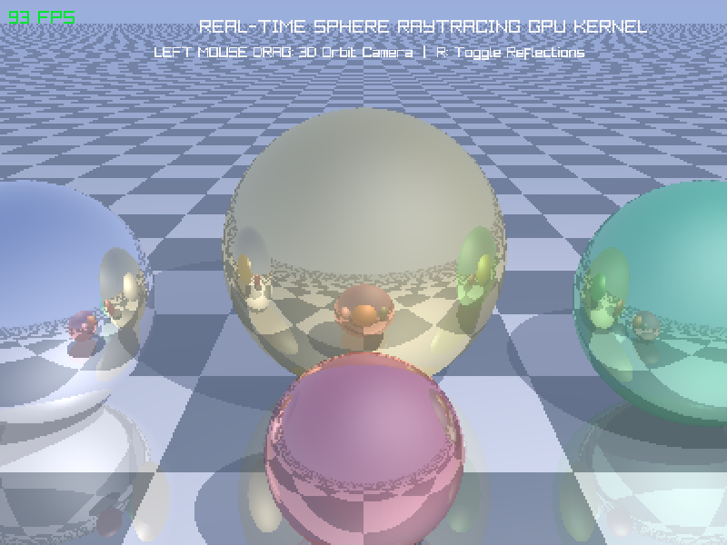
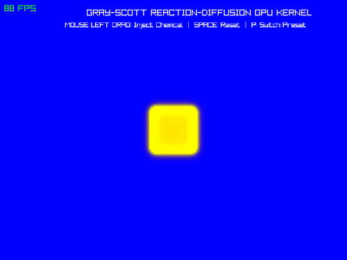

# raylib-mojo

[](https://github.com/raysan5/raylib)
[](https://mojolang.org)
[](https://pixi.sh)
[](LICENSE)

**Mojo bindings for [raylib](https://www.raylib.com/)**, a simple and easy-to-use library to enjoy videogames programming.

## Quick Example

```mojo
from raylib import (
    init_window, window_should_close, close_window, set_target_fps,
    begin_drawing, end_drawing, clear_background, draw_text, draw_fps,
    RAYWHITE, DARKGRAY, LIGHTGRAY, MAROON
)

def main():
    # Initialize window
    init_window(800, 450, "raylib [core] example - basic window")
    set_target_fps(60)

    # Main game loop
    while not window_should_close():
        begin_drawing()
        clear_background(RAYWHITE())

        draw_text("Congrats! You created your first raylib + mojo window!", 120, 200, 20, DARKGRAY())
        draw_fps(10, 10)

        end_drawing()

    # De-initialization
    close_window()
```

## Getting Started

### Prerequisites

All build dependencies and the Mojo environment are automatically managed by [Pixi](https://pixi.sh).

```bash
# Verify pixi is installed
pixi --version
```

### Building Raylib

Clone the repository with submodules and build the shared dynamic library:

```bash
git clone --recursive https://github.com/willGuimont/mojo_raylib.git
cd mojo_raylib

# Build raylib shared library
pixi run build-raylib
```

---

## How to Use `raylib-mojo` in Your Projects

You can use `raylib-mojo` in your own Mojo + Pixi projects in two simple steps:

### 1. Add `raylib-mojo` as a Git Submodule

In your project repository root, add `raylib_mojo` as a submodule:

```bash
git submodule add https://github.com/willGuimont/mojo_raylib third_party/raylib_mojo
git submodule update --init --recursive
```

### 2. Configure `pixi.toml` / `mojoproject.toml`

Configure your project configuration file to include build tools and dependencies. Specify `depends-on = ["build-raylib"]` on your application task so running your app automatically builds `libraylib.so` first:

```toml
[workspace]
name = "my_mojo_game"
version = "0.1.0"
channels = ["conda-forge", "https://conda.modular.com/max"]
platforms = ["linux-64"]

[dependencies]
max = ">=26.5.0"
mojo = ">=1.0.0"
cmake = "*"
ninja = "*"
make = "*"

[tasks]
# Build raylib shared C library
build-raylib = "cmake -B third_party/raylib_mojo/build/raylib -S third_party/raylib_mojo/third_party/raylib -DBUILD_EXAMPLES=OFF -DBUILD_SHARED_LIBS=ON && cmake --build third_party/raylib_mojo/build/raylib"

# Run your Mojo main application (depends on build-raylib task)
start = { cmd = "mojo run -I third_party/raylib_mojo/src -Xlinker -Lthird_party/raylib_mojo/build/raylib/raylib -Xlinker -rpath -Xlinker third_party/raylib_mojo/build/raylib/raylib -Xlinker -lraylib main.mojo", depends-on = ["build-raylib"] }
```

### 3. Build & Run Your Project

Simply execute your task, Pixi will automatically compile `libraylib.so` if needed and launch your Mojo application:

```bash
pixi run start
```

---

## GPU & Compute Kernel Demos

`raylib-mojo` demonstrates GPU acceleration combining MAX `DeviceContext` / `std.gpu` kernels with Raylib framebuffer rendering:

| Mandelbrot & Julia Fractals (`pixi run gpu-mandelbrot`) | N-Body Galaxy Simulation (`pixi run gpu-nbody`) |
| :---: | :---: |
|  |  |

| Real-Time Sphere Raytracer (`pixi run gpu-raytracer`) | Reaction-Diffusion PDE (`pixi run gpu-reaction-diffusion`) |
| :---: | :---: |
|  |  |

---

## Examples

Run any of the included examples using Pixi tasks:

### Standard Examples

| Example / Task | Command | Description |
| :--- | :--- | :--- |
| **Logo Generator** | `pixi run example-logo` | Generates the official raylib-mojo brand logo |
| **Basic Window** | `pixi run example-window` | Basic window creation and text rendering |
| **Bouncing Ball** | `pixi run example-bouncing-ball` | 2D physics and vector movement simulation |
| **2D Collision** | `pixi run example-collision` | Mouse collision detection with rectangles & circles |
| **2D Camera** | `pixi run example-camera-2d` | 2D Camera panning, target tracking & mouse zoom |
| **3D Shapes** | `pixi run example-3d` | 3D rendering with Camera3D, 3D shapes & grid |
| **Audio Stream** | `pixi run example-audio-stream` | Real-time audio waveform synthesis and stream playback |
| **Sprite Animation** | `pixi run example-sprite-anim` | 2D sprite sheet animation, frame clipping & speed control |
| **Particle Assembly** | `pixi run example-particle-assembly` | Interactive 2D physics simulation with 1,200 particles & mouse forces |
| **Game of Life** | `pixi run example-game-of-life` | Conway's Game of Life cellular automata simulation |

### Mojo GPU & Compute Kernel Examples

| Example / Task | Command | Description |
| :--- | :--- | :--- |
| **Mandelbrot & Julia Fractals** | `pixi run gpu-mandelbrot` | Per-pixel parallel compute kernel calculating 480,000 complex iterations per frame with real-time zooming & panning |
| **N-Body Gravity Galaxy** | `pixi run gpu-nbody` | $O(N^2)$ pairwise gravitational force summation kernel evaluating 2.5+ million star interaction vectors per frame |
| **Real-Time Sphere Raytracer** | `pixi run gpu-raytracer` | Per-pixel ray casting, sphere intersection, specular lighting, and reflection bounce compute kernel (240,000+ rays/frame) |
| **Reaction-Diffusion PDE** | `pixi run gpu-reaction-diffusion` | 2D Gray-Scott partial differential equation kernel with 9-point Laplacian stencil convolution for dynamic organic pattern growth |

---

## Development & Automatic Binding Generation

`raylib-mojo` includes a pure Mojo automatic binding generator script ([scripts/generate_bindings.mojo](scripts/generate_bindings.mojo)) that parses Raylib's C declarations from `raylib.h`, `raymath.h`, `rlgl.h`, `rcamera.h`, and `rgestures.h`, maps C types to Mojo types, and verifies each symbol dynamically against `libraylib.so`.

To regenerate the bindings:

```bash
# Automatically builds libraylib.so and regenerates bindings into src/raylib/
pixi run generate-bindings
```

---

## Contributing

Feel free to open an issue. If you'd like to contribute, please fork the repository and make
changes as you'd like. Pull requests are welcome.

If you want to request features or report bugs related to raylib directly (in contrast to this binding), please refer to the [author's project repo](https://github.com/raysan5/raylib).

## License

See [LICENSE](LICENSE.md) for details.
